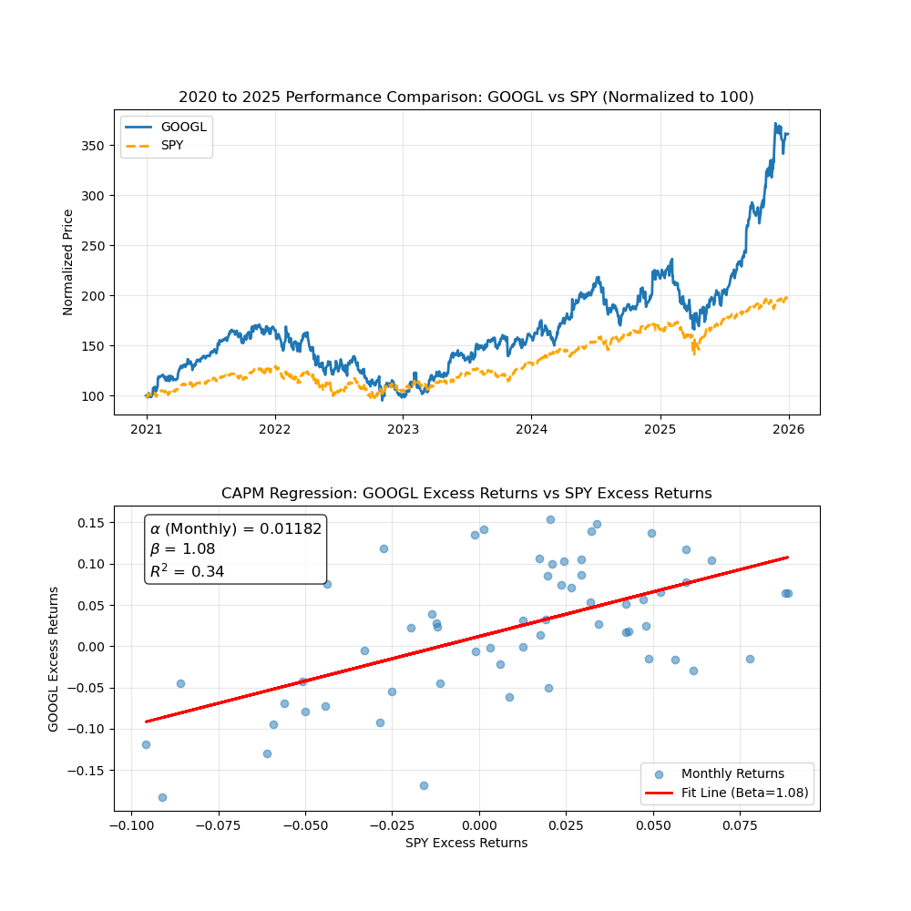

# CAPM Analysis & Stock Beta Calculator

This project implements a **Capital Asset Pricing Model (CAPM)** analysis tool using Python. It fetches historical stock data, calculates key risk metrics (Alpha, Beta, R-Squared) against a market benchmark (S&P 500), and visualizes the performance of specific assets.

## 📐 CAPM & Alpha

### The CAPM Formula
The Capital Asset Pricing Model describes the relationship between systematic risk and expected return for assets, particularly stocks.

$$E(R_i) = R_f + \beta_i (E(R_m) - R_f)$$

Where:
* $E(R_i)$: Expected return of the investment.
* $R_f$: Risk-free rate (typically the yield on government bonds).
* $\beta_i$: Beta of the investment (measure of volatility relative to the market).
* $E(R_m) - R_f$: Market Risk Premium.

### Regression & Alpha ($\alpha$)
In this project, we calculate Beta and Alpha using linear regression on **excess returns** ($R_{excess} = R_{actual} - R_{rf}$).

$$R_{i,t} - R_{f,t} = \alpha_i + \beta_i(R_{m,t} - R_{f,t}) + \epsilon_{i,t}$$

* **Beta ($\beta$):** The slope of the regression line. It represents **Systematic Risk**.
    * $\beta = 1$: Stock moves in sync with the market.
    * $\beta > 1$: Stock is more volatile than the market (Aggressive).
    * $\beta < 1$: Stock is less volatile than the market (Defensive).
* **Alpha ($\alpha$):** The y-intercept of the regression line. It represents **Idiosyncratic Return**.
    * Positive $\alpha$ indicates the asset has outperformed the market return predicted by its risk level (Beta).

---


## 📊 Visual Analysis: GOOGL vs SPY (2020-2025)

The top plot below shows the performance of GOOGL against SPY over 5 years. The bottom plot shows alpha and beta evaluation for GOOGL compared to the market(SPY in this case).


*Figure 1: Top: Normalized price performance (2020–2025). Bottom: Linear regression of monthly excess returns establishing the stock's Beta.*

---

## 🧮 Results

Below are the calculated CAPM metrics for top market-cap stocks based on the 5-year monthly analysi..

| Stock | Ticker | Beta ($\beta$) | Annualized Alpha ($\alpha$) | $R^2$ | Interpretation |
| :--- | :--- | :--- | :--- | :--- | :--- |
| **Nvidia** | NVDA | **2.30** | 0.3819 | 0.47 | Highly volatile; significantly outperforms market. |
| **Tesla** | TSLA | **1.82** | 0.0687 | 0.21 | High volatility; moderate correlation to market. |
| **Amazon** | AMZN | **1.37** | -0.0703 | 0.45 | Volatile; underperformed risk-adjusted expectations. |
| **Meta** | META | **1.28** | 0.0895 | 0.22 | High volatility; positive alpha generation. |
| **Broadcom** | AVGO | **1.19** | 0.3416 | 0.23 | Aggressive growth with high alpha. |
| **Apple** | AAPL | **1.09** | 0.0227 | 0.45 | Moves closely with the market (Beta $\approx$ 1). |
| **Google** | GOOGL| **1.08** | 0.1418 | 0.34 | Moves with market; strong alpha generation. |
| **Microsoft**| MSFT | **1.07** | 0.0355 | 0.53 | Stable growth; high correlation to market. |
| **Berkshire**| BRK-B| **0.72** | 0.0564 | 0.33 | Defensive; low volatility compared to market. |
| **Eli Lilly**| LLY | **0.34** | 0.3615 | 0.02 | Uncorrelated to market; massive alpha (idiosyncratic). |

---


## 🚀 How can we use this Model?

### 1. Valuation (Discounted Cash Flow)
The CAPM output can be used to determine the **Cost of Equity ($k_e$)**, which is a critical input for Discounted Cash Flow (DCF) models to value a company.

**How it works:**
To find the fair value of a stock price today ($P_0$), we sum the present value of its future cash flows ($CF$). The CAPM rate is used as the discount rate $r$ in the denominator.

$$P_0 = \sum_{t=1}^{n} \frac{CF_t}{(1 + k_e)^t}$$

**Example:**
If Google has a Beta of **1.08**:
* Assume Risk-Free Rate ($R_f$) = 4.0%
* Assume Market Return ($R_m$) = 10.0%

$$k_e = 4.0\% + 1.08 (10.0\% - 4.0\%) = 10.48\%$$

Investors should discount Google's future cash flows at **10.48%**. A higher Beta results in a higher discount rate, lowering the present value of the stock (higher risk requires higher reward).

### 2. Portfolio Optimization
Portfolio managers use Beta to construct portfolios that match a specific risk tolerance. The Beta of a portfolio ($\beta_p$) is simply the weighted average of the individual asset Betas.

**How it works:**
$$\beta_p = \sum_{i=1}^{n} w_i \beta_i$$

Where $w_i$ is the weight (percentage) of the stock in the portfolio.

**Application:**
If a manager wants a "Market Neutral" portfolio (Beta = 0) or a "Defensive" portfolio (Beta = 0.8) during a recession, they adjust weights mathematically.

**Example:**
You have a portfolio with 50% **NVDA** ($\beta=2.30$) and 50% **LLY** ($\beta=0.34$).

$$\beta_p = (0.5 \times 2.30) + (0.5 \times 0.34)$$
$$\beta_p = 1.15 + 0.17 = 1.32$$

Despite holding a low-volatility stock (LLY), the heavy weight in NVDA makes this portfolio **32% more volatile** than the S&P 500. To reduce risk, the manager would mathematically solve for new weights to lower $\beta_p$ to 1.0 or lower.

---

## ⚙️ Installation & Usage

1.  **Clone the repository:**
    ```bash
    git clone [https://github.com/yourusername/capm-analysis.git](https://github.com/yourusername/capm-analysis.git)
    ```
2.  **Install dependencies:**
    ```bash
    pip install pandas yfinance scipy matplotlib
    ```
3.  **Run the script:**
    ```bash
    python capm_script.py
    ```
